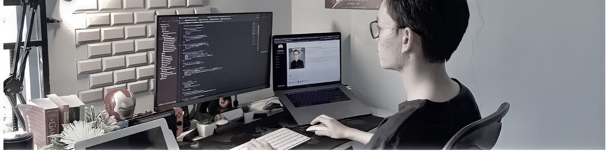

### Hi there  I'm Edo 👋

I'm a Writer of codes, blogs and things that live on the web. An easily inspired inspirational individual with a strong predilection towards most things nerdy and movie addict.Doing experiment to find what is the best,understand someone perspective, solve very small problems day by day. Make more crazy magic happen.

## Find me 🕵🏻‍♂️:
- Website <a href="http://edolorenza.codes/">edolorenza.codes</a> 
- Sharing updates on <a href="https://www.linkedin.com/in/edo-lorenza/">LinkedIn</a> 

<!--
**edolorenza/edolorenza** is a ✨ _special_ ✨ repository because its `README.md` (this file) appears on your GitHub profile.

Here are some ideas to get you started:

- 🔭 I’m currently working on ...
- 🌱 I’m currently learning ...
- 👯 I’m looking to collaborate on ...
- 🤔 I’m looking for help with ...
- 💬 Ask me about ...
- 📫 How to reach me: ...
- 😄 Pronouns: ...
- ⚡ Fun fact: ...
-->
